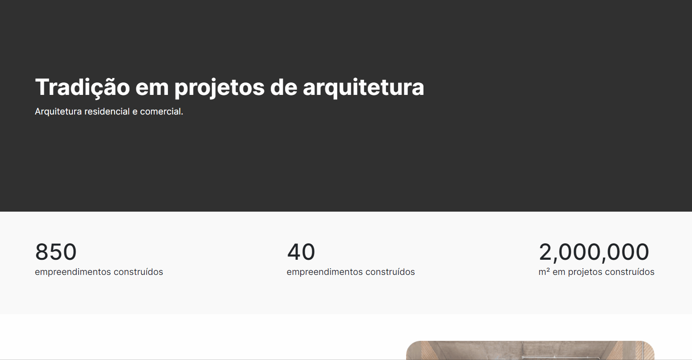

# Projeto acadêmico landpage de engenharia

Bem-vindo(a) ao repositório do projeto acadêmico para a sua empresa de engenharia! Este arquivo README contém informações essenciais sobre o projeto, suas funcionalidades e como utilizá-lo para criar uma presença online eficaz para o seu negócio.

## Como usar

Adicione seu dados no formulário depois aperte em fale conosco. Os dados cadastrados serão direcionados para uma planilha do Google Sheet [clique aqui para acessar](https://docs.google.com/spreadsheets/d/1cYvlCnrLdavu1jPeeq0uI3DfLA6-Dsh0k6AE3FCCN2g/edit?usp=sharing).

## Descrição do Projeto

O objetivo deste projeto é fornecer uma página inicial landpage para a empresa de engenharia, com um formulário de contato integrado a uma planilha do Google Sheets. Essa página será o cartão de visitas online da empresa, permitindo que os visitantes entrem em contato facilmente e forneçam informações relevantes.

## Funcionalidades Principais

1. Design Atraente e Responsivo: A página inicial foi projetada com um design moderno, profissional e responsivo, garantindo uma experiência agradável para os visitantes em dispositivos desktop e móveis.
2. Seção de Destaque: Apresente os principais serviços e competências da sua empresa de engenharia em uma sessão de destaque. Destaque relevantes para atrair a atenção dos visitantes.
3. Formulário de Contato: O projeto inclui um formulário de contato integrado diretamente à página inicial. Os visitantes podem preencher o formulário para enviar mensagens e solicitações de contato para a sua empresa.
4. Integração com Planilha do Google Sheets: Ao utilizar a API do Google Sheets, as informações enviadas pelos visitantes são automaticamente registradas em uma planilha. Isso permite que você acompanhe todas as mensagens recebidas em tempo real e gerencie as solicitações de forma eficiente.

## Autor

Matheus Barreto | 11 96082-1967 | matheusbarretop14@gmail.com | @matth_barreto
